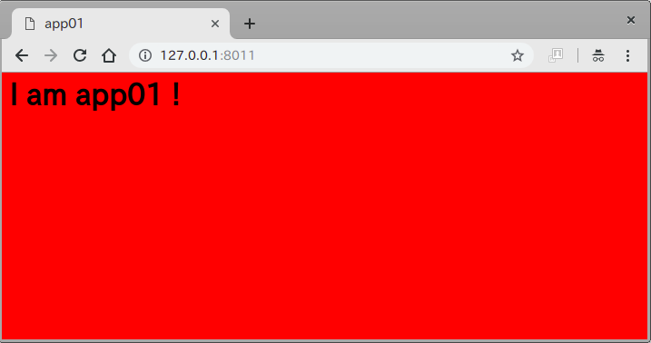
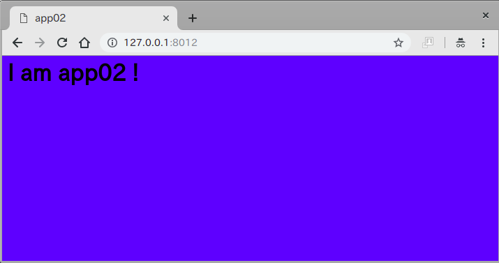
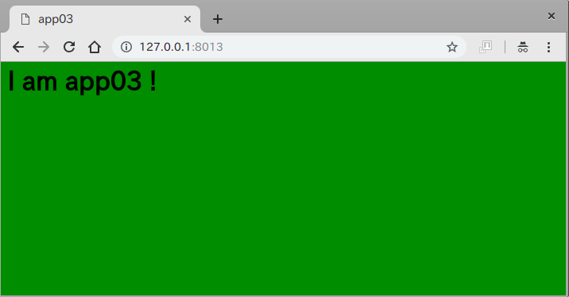

# nginx-loadbalancer

## 用途

+ nginxのロードバランサー機能を簡易テスト出来ます

## 実行方法

### 起動とコマンドライン確認

+ コマンド実行

```
sh build.sh
```

### ブラウザにて確認

+ load balancer
    + http://127.0.0.1:8010
    + app01, app02, app03を均等にバランシングします

+ app01-red
    + http://127.0.0.1:8011



+ app01-blue
    + http://127.0.0.1:8011



+ app01-green
    + http://127.0.0.1:8011
    

