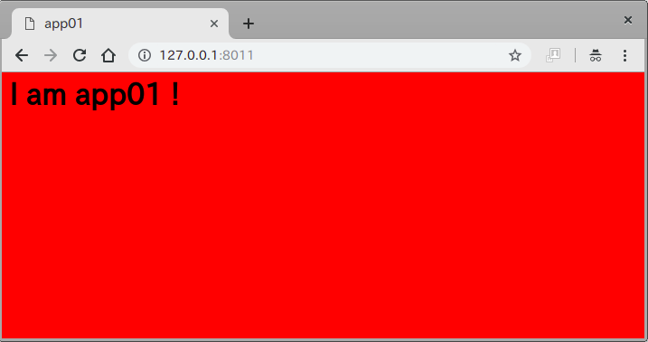
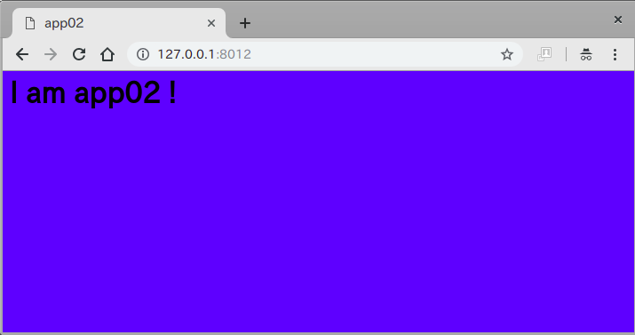
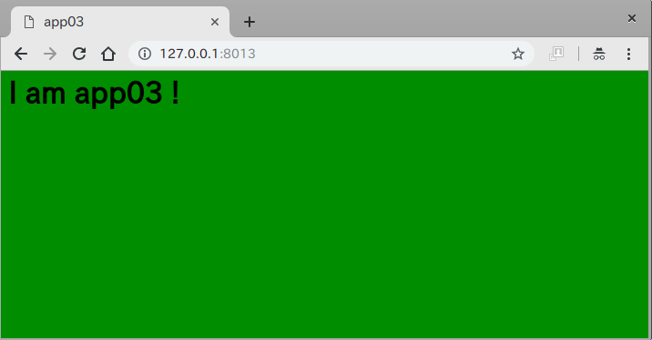

# Nginx loadbalancer


```
#
# 修正中です
#
```


## 用途

+ Nginxのロードバランサー機能を簡易テスト出来ます
+ docker-composeのスケール機能も試すことが出来ます

## [基本] 実行方法

### 起動と確認のコマンドライン

+ 起動コマンドライン

```
sh dcs.sh start
```

+ ステータス確認コマンドライン

```
 sh dcs.sh status
```

### ブラウザにて確認

+ load balancer
    + http://127.0.0.1:8010
    + app01, app02, app03を均等にバランシングします

+ app01-red
    + http://127.0.0.1:8011



+ app01-blue
    + http://127.0.0.1:8011



+ app01-green
    + http://127.0.0.1:8011
    


## [応用] スケール

### docker-composeにて起動

+ 起動コマンドライン

```
docker-compose -f docker-compose.scale.yml up -d
```

+ ステータス確認コマンドライン

```
docker-compose ps
```
```
$ docker-compose ps
            Name                      Command          State          Ports        
-----------------------------------------------------------------------------------
10_nginx-loadbalancer_app01_1   nginx -g daemon off;   Up      80/tcp              
10_nginx-loadbalancer_app02_1   nginx -g daemon off;   Up      80/tcp              
10_nginx-loadbalancer_app03_1   nginx -g daemon off;   Up      80/tcp              
nginx-lb                        nginx -g daemon off;   Up      0.0.0.0:8010->80/tcp
```

### スケールアウト

```
docker-compose -f docker-compose.scale.yml up -d --scale app01=5
```
```
$ docker-compose ps
            Name                      Command          State          Ports        
-----------------------------------------------------------------------------------
10_nginx-loadbalancer_app01_1   nginx -g daemon off;   Up      80/tcp              
10_nginx-loadbalancer_app01_2   nginx -g daemon off;   Up      80/tcp              
10_nginx-loadbalancer_app01_3   nginx -g daemon off;   Up      80/tcp              
10_nginx-loadbalancer_app01_4   nginx -g daemon off;   Up      80/tcp              
10_nginx-loadbalancer_app01_5   nginx -g daemon off;   Up      80/tcp              
10_nginx-loadbalancer_app02_1   nginx -g daemon off;   Up      80/tcp              
10_nginx-loadbalancer_app03_1   nginx -g daemon off;   Up      80/tcp              
nginx-lb                        nginx -g daemon off;   Up      0.0.0.0:8010->80/tcp
```

### スケールイン

```
docker-compose -f docker-compose.scale.yml up -d --scale app01=2
```
```
$ docker-compose ps
            Name                      Command          State          Ports        
-----------------------------------------------------------------------------------
10_nginx-loadbalancer_app01_1   nginx -g daemon off;   Up      80/tcp              
10_nginx-loadbalancer_app01_2   nginx -g daemon off;   Up      80/tcp              
10_nginx-loadbalancer_app02_1   nginx -g daemon off;   Up      80/tcp              
10_nginx-loadbalancer_app03_1   nginx -g daemon off;   Up      80/tcp              
nginx-lb                        nginx -g daemon off;   Up      0.0.0.0:8010->80/tcp
```

+ `0` も可能

```
docker-compose -f docker-compose.scale.yml up -d --scale app01=0
```
```
$ docker-compose ps
            Name                      Command          State          Ports        
-----------------------------------------------------------------------------------
10_nginx-loadbalancer_app02_1   nginx -g daemon off;   Up      80/tcp              
10_nginx-loadbalancer_app03_1   nginx -g daemon off;   Up      80/tcp              
nginx-lb                        nginx -g daemon off;   Up      0.0.0.0:8010->80/tcp
```
